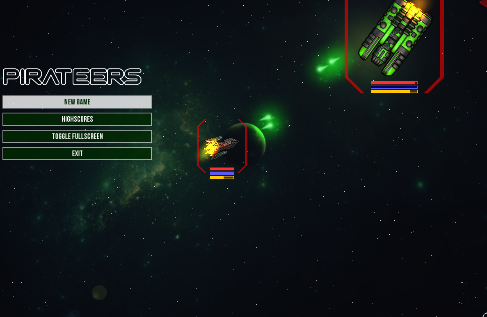

# Pirateers

A small 2D space shooter I made in the in the context of the lecture 
[PADI](https://graphics.tu-bs.de/teaching/ws1617/padi).

### About the Game
Become a space pirate and raid rich space merchants with fancy space weapons. pew pew.
But keep out for those space guards.

### Features
- Multiple weapon, enemy types and enemy AIs
- Multiple factions
- Upgrade your ship at the shop!
- Explosions!
- Increasing difficulty

### About the source code
This game is built with a Entity Component System, meaning that entities do not emerge
from huge inheritance trees but in a modular approach. A weapon component for example can therefore
be easily integrated in every entity of almost any type.

Pirateers was my very first C++ project. The documentation is, just like the lecture, in german.

### Ship editor
Visit [Shipeditor] for further details

### Dependencies
- **SFML** (> 2.4) for graphics, sound and input
- **Box2D** for physics
- **Boost** (System and FileSystem) for resources directory traversal
- **Qt** for the ship editor GUI

### Credits

Textures:
- Sprites for Ships from [MillionthVector](https://millionthvector.blogspot.de/p/free-sprites.html)
- Battle music from [Freelancer](https://en.wikipedia.org/wiki/Freelancer_(video_game))
- "Calm" music from [Alexandr Zhelanov](https://opengameart.org/content/space-atmospere)
- [Kenney](http://www.kenney.nl/)

Sounds:
- [Isaac200000](https://freesound.org/people/Isaac200000/)
- [Kenney] https://opengameart.org/content/63-digital-sound-effects-lasers-phasers-space-etc
- [bubaproducer](https://freesound.org/people/bubaproducer/sounds/151022/)
- [nsstudios](https://freesound.org/people/nsstudios/)
- [Julien Matthey] (https://freesound.org/people/Julien%20Matthey/sounds/268344/)
- [Michael Kurinnoy] (https://opengameart.org/content/space-battle-game-sounds-astromenace)

Fonts
- Ryoichi Tsunekawa
- GNU FreeFont
- ALLTYPE

